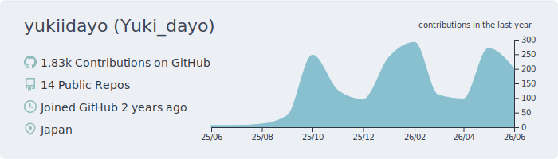
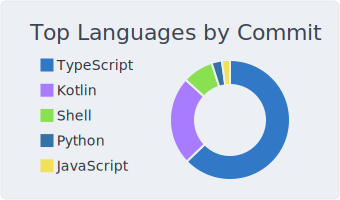
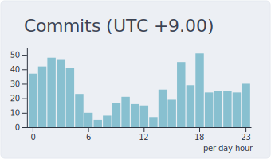

# Yukidayo

I like building things. Lately, I've been exploring web, mobile, servers, and networks.
***

## Activity

<picture>
  <source media="(prefers-color-scheme: dark)" srcset="profile-summary-card-output/nord_dark/0-profile-details.svg" />
  <source media="(prefers-color-scheme: light)" srcset="profile-summary-card-output/nord_bright/0-profile-details.svg" />
  
</picture>

 

<picture>
  <source media="(prefers-color-scheme: dark)" srcset="profile-summary-card-output/nord_dark/2-most-commit-language.svg" />
  <source media="(prefers-color-scheme: light)" srcset="profile-summary-card-output/nord_bright/2-most-commit-language.svg" />
  
</picture>
<picture>
  <source media="(prefers-color-scheme: dark)" srcset="profile-summary-card-output/nord_dark/4-productive-time.svg" />
  <source media="(prefers-color-scheme: light)" srcset="profile-summary-card-output/nord_bright/4-productive-time.svg" />
  
</picture>

## Tech Stack

**Main skills**  

**Building with**  

**Learning**  

